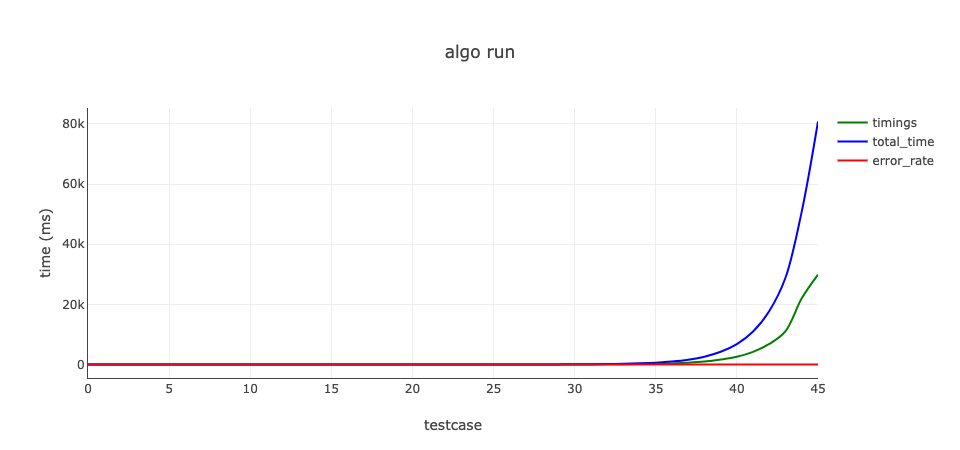
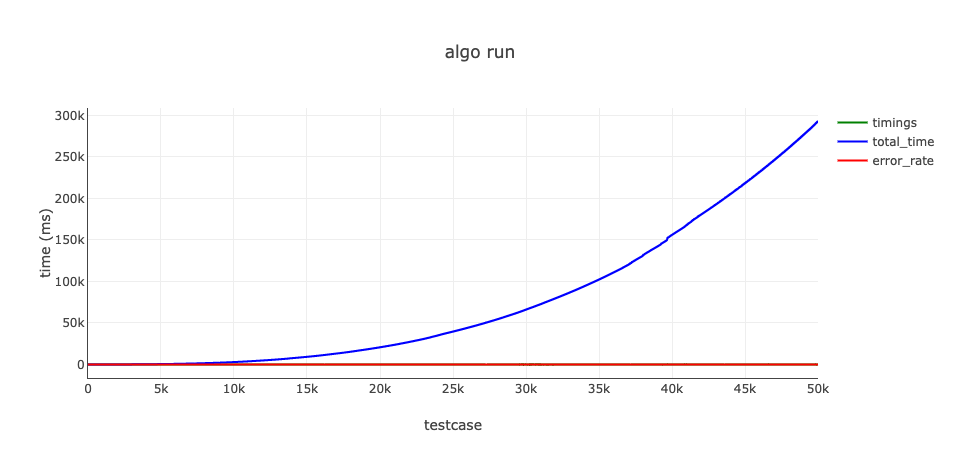

# Plot twist. On 2025-03-27 with AIs and stuff I got stupid enough to code this [shit](https://gist.github.com/cybor97/6b7b7ede9ccd7ceeddc93322eee0cd91)

# Plots generated by `./algos/*.js`
## Fibonacci/runRecursive
Total time: 80808, Cases 46 

## Fibonacci/runRecursiveMemo
Total time: 12016, Cases 10001 

## Fibonacci/runLoop
Total time: 292709, Cases 50000 

